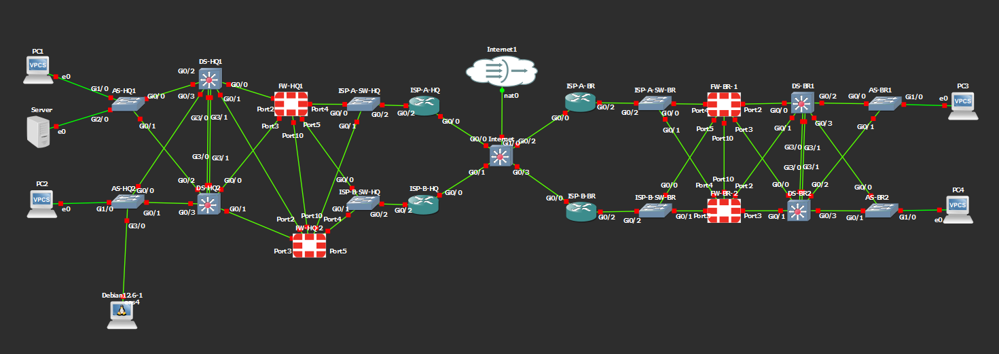
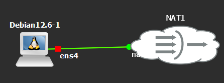

# Greenfield Network Automation HQ + Branch Lab — Step-by-Step Deployment

Two-site GNS3 lab. HQ + Branch, dual-ISP each, FortiGate active/passive HA at each
site, IPsec overlay with OSPF area 0 inside the tunnels. Ansible control node sits
on the HQ access network and manages everything in-band — Cisco IOS over SSH,
FortiGate over the FortiOS HTTPS API.

---

## Topology



> HQ and Branch each run a redundant access / distribution layer behind a dual-ISP
> FortiGate active/passive HA pair. The two sites are joined by an IPsec overlay running
> OSPF area 0. The Ansible controller sits on the HQ management VLAN (10.10.99.0/24).

---

## Purpose

Hello, I'm a recent graduate with no prior hands-on experience in network automation or
firewall administration — before this I had never written an Ansible playbook or
configured a FortiGate. This mini-project is my deliberate attempt to learn both at
once, by building a two-site enterprise network from scratch and automating
its rollout end to end.

What I set out to learn:

- **Ansible for network devices** (Cisco IOS + FortiGate) — inventory, roles, variables, and idempotent config push instead of typing every box by hand.
- **FortiGate for real** — interfaces, firewall policies, IPsec site-to-site VPN, and active/passive HA.
- **The fundamentals that tie it together** — OSPF, HSRP, VLANs/trunking, and dual-ISP routing.

\*This is a learning lab for my own study, not a production-ready design — see **Caveats** below.

---

## Step 1 — Cable the topology in GNS3

**See `CABLING.md` for the full port-by-port map.** Key points:

Inside (HQ, full mesh, transit VLAN 100):

- DS-HQ1 G0/0 → FW-HQ1 Port2, DS-HQ1 G0/1 → FW-HQ2 Port2
- DS-HQ2 G0/0 → FW-HQ2 Port3, DS-HQ2 G0/1 → FW-HQ1 Port3
- DS-HQ1/2 G3/0 + G3/1 → peer DS (port-channel)
- FW-HQ1 Port10 ↔ FW-HQ2 Port10 (HA heartbeat)

WAN (HQ) — each FW member to BOTH wan switches:

- FW-HQ1 Port4 + FW-HQ2 Port4 → ISP-A-SW-HQ → ISP-A-HQ → Internet
- FW-HQ1 Port5 + FW-HQ2 Port5 → ISP-B-SW-HQ → ISP-B-HQ → Internet

Controller: AS-HQ2 G3/0 → Controller eth0

Branch mirrors the same pattern (transit VLAN 200, ISP-x-SW-BR switches).

---

## Step 2 — Set-up bootstraps (in this order)

For each device, console in, paste the matching file from `bootstrap/`, save.

**Order matters** — bottom-up so each layer comes up against an already-configured neighbor.

1. **Internet** ← `Internet.txt`
2. **ISP-A-HQ, ISP-B-HQ, ISP-A-BR, ISP-B-BR** ← matching files
3. **ISP-A-SW-HQ, ISP-B-SW-HQ, ISP-A-SW-BR, ISP-B-SW-BR** ← the 4 WAN switches (console-only, no mgmt IP)
4. **FW-HQ-1** ← `FW-HQ-1.txt`, **FW-BR-1** ← `FW-BR-1.txt` (the HA primaries — full config)
5. **FW-HQ-2** ← `FW-HQ-2.txt`, **FW-BR-2** ← `FW-BR-2.txt` (the HA secondaries — **HA block only**; the primary syncs the rest after the cluster forms)
6. **DS-HQ1, DS-HQ2, DS-BR1, DS-BR2** ← matching files
7. **AS-HQ1, AS-HQ2, AS-BR1, AS-BR2** ← matching files

> **FortiGate-VM HA needs a unique serial per unit.** If you clone the FortiGate VMs — or
> import the same license file into both — the two members share a serial and the cluster
> never forms (each reports _"the only member in the cluster"_). Give every VM its own
> serial/license, run the **same FortiOS version** on both members of a pair, and cable
> `port10 ↔ port10` for the HA heartbeat. The secondary only needs the HA block in its
> `FW-*-2.txt`; everything else syncs from the primary once the cluster is up.

### What you should see after Step 2

- FW HA cluster formed at each site (`get system ha status` → 2 members, in-sync)
- FW-HQ ↔ FW-BR IPsec tunnels up (`get vpn ipsec tunnel summary`)
- OSPF neighborship between the two FWs over both tunnels
- DS switches reachable from HQ controller subnet (10.10.99.0/24) only — BR is **not** reachable yet because the DS switches aren't in OSPF

---

## Step 3 — Bring up the Ansible controller

The controller is the GNS3 **Debian** appliance, cabled to **AS-HQ2 G3/0**
(access port in VLAN 99 / HQ-MGMT). Notes on this appliance:

- It uses **`/etc/network/interfaces`** (ifupdown), _not_ netplan.
- It has **no systemd** — use `ifup`/`ifdown` or `service networking restart`, not `systemctl`.
- Its NIC may enumerate as `eth0` or `ensX` — confirm with `ip -br link` and use that name below.
- The default appliance disk is only **2 GiB** — too small for Ansible + a venv. **Grow it
  first** (next section) or you'll hit `No space left on device` mid-install.

### Grow the appliance disk (do this first)

The appliance ships with a 2 GiB disk that fills up while installing Ansible. Expand it in
two stages — first the virtual disk on the host, then the partition + filesystem inside.

**Stage 1 — enlarge the qcow2 (node POWERED OFF in GNS3).** On the GNS3 VM, find the node's
disk under `…/project-files/qemu/<node-id>/hda_disk.qcow2`, then:

```bash
qemu-img resize hda_disk.qcow2 +10G     # 2 GiB → 12 GiB
qemu-img info  hda_disk.qcow2           # confirm new virtual size
```

**Stage 2 — grow the partition + filesystem (boot the node).** If the disk is already full
you can't `apt install cloud-guest-utils`, so free a little space first, then grow:

```bash
sudo dpkg --configure -a            # finish any interrupted install
sudo apt clean && sudo rm -rf /var/lib/apt/lists/*

# preferred: growpart (clean, keeps the PARTUUID)
sudo apt install -y cloud-guest-utils
sudo growpart /dev/sda 1
sudo resize2fs /dev/sda1
df -h /                              # should now show ~12 GiB
```

**If `growpart` won't install (still 0 bytes free), use `fdisk`** — it needs no packages.
Delete and recreate partition 1 **at the exact same start sector**, and answer **N** when
asked to remove the ext4 signature (that keeps your data):

```bash
sudo fdisk /dev/sda
#  p            → note partition 1's START sector
#  d → 1        → delete it
#  n → 1        → recreate; enter the SAME start sector, Enter for the end
#  N            → do NOT remove the ext4 signature
#  w            → write
sudo partprobe /dev/sda             # or reboot the node
sudo resize2fs /dev/sda1
```

> ⚠️ **fdisk gotcha — boot fails with `PARTUUID … does not exist` / drops to initramfs.**
> Recreating the partition gives it a **new PARTUUID**, but GRUB still looks for the old one
> (shown in the error). Data is fine — just restore the original PARTUUID. With the node
> stopped, on the GNS3 VM:
>
> ```bash
> sudo apt-get install -y gdisk qemu-utils
> sudo modprobe nbd max_part=16
> sudo qemu-nbd --connect=/dev/nbd0 hda_disk.qcow2
> sudo sgdisk --partition-guid=1:<OLD-PARTUUID-FROM-ERROR> /dev/nbd0
> sudo qemu-nbd --disconnect /dev/nbd0
> ```
>
> This is why `growpart` is preferred — it never changes the PARTUUID.

Lab (mgmt) IP config — `/etc/network/interfaces`:

```
auto eth0
iface eth0 inet static
    address 10.10.99.20
    netmask 255.255.255.0
    gateway 10.10.99.1
    dns-nameservers 8.8.8.8
```

> ⚠️ `gateway 10.10.99.1` is the **HSRP VIP**, which does **not exist until Step 4**.
> So the controller has **no in-band internet yet** — it can only reach the four HQ
> devices on `10.10.99.0/24` (DS-HQ1/2, AS-HQ1/2). See "Temporary internet" below
> to install the tooling.

### Temporary internet — to install Ansible before Step 4

Installing Ansible needs internet, which the mgmt subnet can't provide until Step 4
(real networks pre-stage the controller for exactly this reason). Temporarily give it
internet through a **NAT** node:



```bash
# In GNS3: move the controller's link from AS-HQ2 G3/0 → a NAT node.
sudo ifdown eth0            # drop the static config (dead .1 gateway)
sudo dhclient eth0          # get IP + default route + DNS from the NAT node
ping -c2 8.8.8.8            # confirm internet
# If apt connects but stalls at 0%, it's MTU:  sudo ip link set eth0 mtu 1400

# Debian 12 (PEP 668) blocks system-wide pip with "externally-managed-environment".
# Install Ansible + the extra libs the playbooks need inside a venv instead.
sudo apt update && sudo apt install -y python3-full python3-venv
python3 -m venv ~/ansible-env
source ~/ansible-env/bin/activate            # prompt now shows (ansible-env)

pip install --upgrade pip
pip install ansible ansible-pylibssh paramiko netaddr
ansible-galaxy collection install cisco.ios fortinet.fortios ansible.netcommon ansible.utils

sudo dhclient -r eth0       # release the lease
sudo ifup eth0              # restore the static lab config
# In GNS3: move the controller's link back to AS-HQ2 G3/0.
```

> 🐍 **The venv must be active for every later Ansible step.** Run
> `source ~/ansible-env/bin/activate` at the start of each session (or append it to
> `~/.bashrc` to auto-activate on login). Installing `ansible` _inside_ the venv — not
> via apt — is what lets it see the `paramiko`/`netaddr`/`ansible.utils` deps living there.

`netaddr` + `ansible.utils` are required by the `dist_switch` role's `ipaddr` filter —
without them `dist.yml` fails. Then drop the `ansible/` folder onto the controller:

```bash
scp -r ansible/ admin@controller:/home/admin/
cd /home/admin/ansible
```

### Verify the tooling

```bash
source ~/ansible-env/bin/activate     # activate the venv (prompt shows (ansible-env))
ansible --version
ansible-galaxy collection list | grep -Ei 'cisco.ios|fortinet.fortios|ansible.netcommon|ansible.utils'
python3 -c "import paramiko, netaddr; print('libs ok')"
ansible-playbook -i inventory/hosts.yml playbooks/site.yml --syntax-check
```

### Quick sanity check (back on the mgmt subnet)

```bash
source ~/ansible-env/bin/activate     # if not already active this session
ansible -i inventory/hosts.yml dist_switches -m cisco.ios.ios_facts --limit 'DS-HQ1,DS-HQ2'
```

Only the four HQ IOS devices on `10.10.99.0/24` (DS-HQ1/2, AS-HQ1/2) respond at this
stage. **FW-HQ** (managed at its inside-sw transit IP `10.10.100.1`) and **all Branch
devices** are **not reachable yet** — they come online only after Step 4 brings up HSRP
(the `.1` gateway) and OSPF (the return route + remote subnets).

---

## Step 4 — Run Ansible site-wide

```bash
source ~/ansible-env/bin/activate     # activate the venv first (every new session)
ansible-playbook -i inventory/hosts.yml playbooks/site.yml
```

What this does in order (via `site.yml`):

1. `dist.yml` — adds VLANs, SVIs, HSRP, OSPF, removes the temp static defaults
2. `access.yml` — pushes user VLANs and host-port assignments
3. `fortigate.yml` — DNS, NTP, day-1 hygiene on the FW pair

> ISP routers + Internet are **not** automated — they are fully configured at bootstrap
> (Step 2), so `site.yml` does not touch them.

After `dist.yml` finishes, branch DS/AS become reachable (OSPF on DS pair → routes flow). The remaining plays then complete normally.

---

## Step 5 — Verify

From any HQ device:

```
ping 10.20.199.2          # DS-BR1 SVI — should succeed
ping 10.20.110.101        # PC3 — should succeed
show ip ospf neighbor     # On a DS: 1 FW neighbor + 1 peer DS = at least 2 neighbors
```

From a HQ FortiGate:

```
get router info ospf neighbor       # DS pair + remote FW = 3+ neighbors
get vpn ipsec tunnel summary        # both tunnels "up"
diagnose sys ha status              # active/passive, both members in sync
```

---

## Design reference

### Addressing

Loopbacks (Lo0 / OSPF router-id):

| Device   | Lo0            |
| -------- | -------------- |
| DS-HQ1   | 10.255.0.1/32  |
| DS-HQ2   | 10.255.0.2/32  |
| DS-BR1   | 10.255.0.11/32 |
| DS-BR2   | 10.255.0.12/32 |
| FW-HQ    | 10.255.0.21/32 |
| FW-BR    | 10.255.0.31/32 |
| ISP-A-HQ | 10.255.1.1/32  |
| ISP-B-HQ | 10.255.1.2/32  |
| ISP-A-BR | 10.255.1.11/32 |
| ISP-B-BR | 10.255.1.12/32 |
| Internet | 10.255.1.99/32 |

User + mgmt VLANs:

| VLAN | Name       | Subnet         | HSRP VIP    | Site |
| ---- | ---------- | -------------- | ----------- | ---- |
| 10   | HQ-USERS   | 10.10.10.0/24  | 10.10.10.1  | HQ   |
| 20   | HQ-USERS2  | 10.10.20.0/24  | 10.10.20.1  | HQ   |
| 30   | HQ-SERVERS | 10.10.30.0/24  | 10.10.30.1  | HQ   |
| 99   | HQ-MGMT    | 10.10.99.0/24  | 10.10.99.1  | HQ   |
| 110  | BR-USERS   | 10.20.110.0/24 | 10.20.110.1 | BR   |
| 120  | BR-USERS2  | 10.20.120.0/24 | 10.20.120.1 | BR   |
| 199  | BR-MGMT    | 10.20.199.0/24 | 10.20.199.1 | BR   |

**DS ↔ FW is an L2 transit VLAN, not P2P /30s.** Each FortiGate bridges its two inside
ports (`port2` + `port3`) into a software switch `inside-sw` that carries **one**
HA-floating L3 IP. Both DS switches land in that transit VLAN as access ports, giving a
redundant mesh behind a single inside gateway per site:

| Site | Transit VLAN | Subnet         | FW `inside-sw` | DS-1 | DS-2 |
| ---- | ------------ | -------------- | -------------- | ---- | ---- |
| HQ   | 100          | 10.10.100.0/29 | 10.10.100.1    | .2   | .3   |
| BR   | 200          | 10.20.200.0/29 | 10.20.200.1    | .2   | .3   |

OSPF runs over the transit (broadcast network-type), so the DS pair and the FW form
adjacencies there. The `inside-sw` IP is the inside default gateway and floats with HA.

> **Management note:** HQ devices are managed on the mgmt VLAN (99 / `10.10.99.0/24`),
> where the Ansible controller also sits. The **Branch DS switches are managed on their
> transit-VLAN SVI** (`10.20.200.2/.3`), _not_ the BR mgmt VLAN — at cold bootstrap the BR
> mgmt subnet (`10.20.199.0/24`) isn't advertised anywhere yet, but the transit `/29` is
> (the FW advertises it and is directly connected), so it's the only Branch address
> reachable before OSPF converges. BR **access** switches stay on the mgmt VLAN
> (`10.20.199.11/.12`) and come online once `dist.yml` brings up their gateway + OSPF.

Simulated "Internet" (100.64.0.0/10):

| Link                  | Subnet          |
| --------------------- | --------------- |
| FW-HQ wan1 ↔ ISP-A-HQ | 100.64.10.0/30  |
| FW-HQ wan2 ↔ ISP-B-HQ | 100.64.20.0/30  |
| ISP-A-HQ ↔ Internet   | 100.64.100.0/30 |
| ISP-B-HQ ↔ Internet   | 100.64.101.0/30 |
| ISP-A-BR ↔ Internet   | 100.64.200.0/30 |
| ISP-B-BR ↔ Internet   | 100.64.201.0/30 |
| FW-BR wan1 ↔ ISP-A-BR | 100.64.110.0/30 |
| FW-BR wan2 ↔ ISP-B-BR | 100.64.120.0/30 |

IPsec overlay (169.254.0.0/16 link-local, never on the wire):

| Tunnel | Underlay | Subnet         | HQ end | BR end |
| ------ | -------- | -------------- | ------ | ------ |
| vpn-a  | ISP-A    | 169.254.1.0/30 | .1     | .2     |
| vpn-b  | ISP-B    | 169.254.2.0/30 | .1     | .2     |

OSPF area 0 runs over both tunnels. ECMP between sites.

### HSRP

| VLAN | Active | Standby | Priorities |
| ---- | ------ | ------- | ---------- |
| 10   | DS-HQ1 | DS-HQ2  | 110 / 100  |
| 20   | DS-HQ2 | DS-HQ1  | 110 / 100  |
| 30   | DS-HQ1 | DS-HQ2  | 110 / 100  |
| 99   | DS-HQ1 | DS-HQ2  | 110 / 100  |
| 110  | DS-BR1 | DS-BR2  | 110 / 100  |
| 120  | DS-BR2 | DS-BR1  | 110 / 100  |
| 199  | DS-BR1 | DS-BR2  | 110 / 100  |

### Credentials

- User: `admin`
- Password: `Admin@123`
- IPsec PSKs: `PskVpnA@2026`, `PskVpnB@2026`
- FortiGate HA passwords: `HaSecret@HQ`, `HaSecret@BR`

---

## Caveats

- **IOSvL2 HSRP** — works in most 15.2 builds. If yours rejects `standby` commands on SVIs, swap DS for vIOS-L3 or CSR1000v; configs port over unchanged.
- **FortiGate port mapping** — assumes port2+port3 = inside (bridged into `inside-sw`), port4 = wan1, port5 = wan2, port10 = HA heartbeat. Adjust the `edit "portN"` lines in the FW bootstraps if your GNS3 port ordering differs.
- **No vault yet** — secrets are plaintext in `group_vars/all.yml` for clarity. Wrap with `ansible-vault encrypt_string` before this leaves the lab.

---

## File layout

```
greenfield/
├── README.md
├── bootstrap/                ← step 2 inputs
│   ├── Internet.txt
│   ├── ISP-{A,B}-{HQ,BR}.txt
│   ├── FW-HQ-{1,2}.txt        ← -1 primary (full), -2 secondary (HA block only)
│   ├── FW-BR-{1,2}.txt
│   ├── DS-HQ{1,2}.txt
│   ├── DS-BR{1,2}.txt
│   └── AS-{HQ,BR}{1,2}.txt
└── ansible/                  ← step 4 inputs
    ├── ansible.cfg
    ├── inventory/
    │   ├── hosts.yml
    │   ├── group_vars/       ← must sit next to the inventory to load
    │   └── host_vars/
    ├── roles/{common,access_switch,dist_switch,fortigate}/
    └── playbooks/{site,dist,access,fortigate}.yml
```
